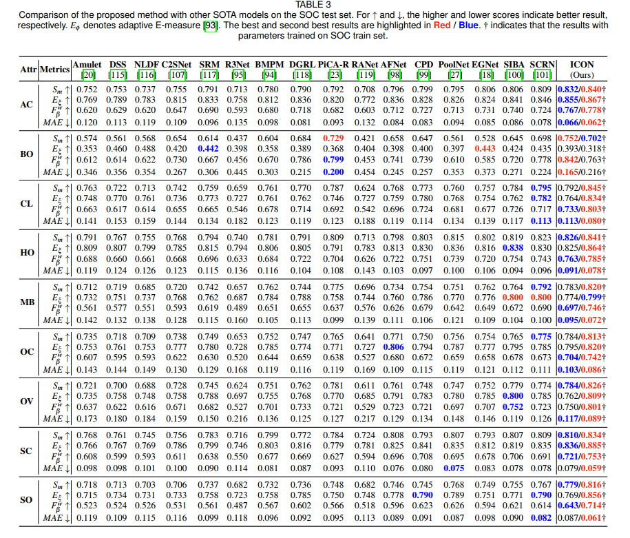

# Efficient SOC Toolbox / [SOC快速评测工具(中文Readme)](https://github.com/mczhuge/SOCToolbox/edit/main/README_CN.md)

## 1. Datasets and Training Setting

Noted that, some early methods have used different training settings, this may cause unfair comparisons. So, the author of SOC recommend to use these setting:

- (1) using both train and val set of SOC to train your model. 
- (2) besides, it is better to drop images without salient objects for training and testing.

We have updated the Train (2400/4800 for training) / Test (8 attributes) setting following above suggestions. 

For a quick employment, you can download the updated SOC on [Baidu | 提取码: iqul ](https://pan.baidu.com/s/1kWebPUhCQOCsvvAouo7eGQ). 

**If you download SOC on above link, you can ignore procedures below.**

----

(A) You can generates train.txt list which drops images without salient objects by


```
python ./Train/SOC/drop_blank_and_generate_list.py 
```

(B) You can segment 8 attributes of testing set and their test.txt by

```
python ./Test/SOC/attr_categoty_and_generate_list.py 
```

Then 8 file folders will be generated, which are `./datasets/SOC/Test/SOC-AC`, `./datasets/SOC/Test/SOC-BO`, `./datasets/SOC/Test/SOC-CL`, `./datasets/SOC/Test/SOC-HO`, `./datasets/SOC/Test/SOC-MB`, `./datasets/SOC/Test/SOC-OC`, `./datasets/SOC/Test/SOC-OV`, `./datasets/SOC/Test/SOC-SO`. They contain the images and GTs of each category.

**Actually, we have already processed A and B if you download SOC from above link.** (If needing, the original SOC dataset can be found [here](https://dpfan.net/socbenchmark/) and you can do A and B yourself.)

## 2. Evaluation

When your training process has done, you should generate the predictions of `SOC-AC`, `SOC-BO`, `SOC-CL`, `SOC-HO`, `SOC-MB`, `SOC-OC`, `SOC-OV` and `SOC-SO`, respectively.

An alternative method is to generate all SOC-Test, then modify the `attr_categoty_and_generate_list.py` to automatively split your predicted saliency maps.

After that, you can evaluate your performance on SOC in ~2 minutes. 

```
sh run_eval.sh
```

## 3. Results

```
Method:ICON,Dataset:SOC,Attribute:SOC-AC||Smeasure:0.84; wFmeasure:0.778; MAE:0.062; adpEm:0.89; meanEm:0.885; maxEm:0.894; adpFm:0.803; meanFm:0.806; maxFm:0.822
Method:ICON,Dataset:SOC,Attribute:SOC-BO||Smeasure:0.7; wFmeasure:0.762; MAE:0.216; adpEm:0.599; meanEm:0.725; maxEm:0.787; adpFm:0.739; meanFm:0.811; maxFm:0.862
Method:ICON,Dataset:SOC,Attribute:SOC-CL||Smeasure:0.845; wFmeasure:0.803; MAE:0.08; adpEm:0.874; meanEm:0.883; maxEm:0.893; adpFm:0.835; meanFm:0.834; maxFm:0.847
Method:ICON,Dataset:SOC,Attribute:SOC-HO||Smeasure:0.841; wFmeasure:0.785; MAE:0.078; adpEm:0.873; meanEm:0.88; maxEm:0.892; adpFm:0.81; meanFm:0.815; maxFm:0.834
Method:ICON,Dataset:SOC,Attribute:SOC-MB||Smeasure:0.82; wFmeasure:0.746; MAE:0.072; adpEm:0.846; meanEm:0.862; maxEm:0.87; adpFm:0.772; meanFm:0.781; maxFm:0.794
Method:ICON,Dataset:SOC,Attribute:SOC-OC||Smeasure:0.813; wFmeasure:0.742; MAE:0.086; adpEm:0.847; meanEm:0.859; maxEm:0.873; adpFm:0.775; meanFm:0.78; maxFm:0.8
Method:ICON,Dataset:SOC,Attribute:SOC-OV||Smeasure:0.826; wFmeasure:0.801; MAE:0.089; adpEm:0.86; meanEm:0.872; maxEm:0.88; adpFm:0.833; meanFm:0.833; maxFm:0.844
Method:ICON,Dataset:SOC,Attribute:SOC-SO||Smeasure:0.816; wFmeasure:0.714; MAE:0.061; adpEm:0.869; meanEm:0.873; maxEm:0.884; adpFm:0.734; meanFm:0.745; maxFm:0.766
```

## 4. Others methods 
 

## 5. Acknowledgement
Some codes are borrowed from:
* <https://github.com/lartpang/PySODMetrics> 

## Reference

```text
@inproceedings{Smeasure,
    title={Structure-measure: A new way to evaluate foreground maps},
    author={Fan, Deng-Ping and Cheng, Ming-Ming and Liu, Yun and Li, Tao and Borji, Ali},
    booktitle=ICCV,
    pages={4548--4557},
    year={2017}
}

@inproceedings{Emeasure,
    title="Enhanced-alignment Measure for Binary Foreground Map Evaluation",
    author="Deng-Ping {Fan} and Cheng {Gong} and Yang {Cao} and Bo {Ren} and Ming-Ming {Cheng} and Ali {Borji}",
    booktitle=IJCAI,
    pages="698--704",
    year={2018}
}

@article{zhuge2021salient,
  title={Salient Object Detection via Integrity Learning},
  author={Zhuge, Mingchen and Fan, Deng-Ping and Liu, Nian and Zhang, Dingwen and Xu, Dong and Shao, Ling},
  journal={arXiv preprint arXiv:2101.07663},
  year={2021}
}
```

